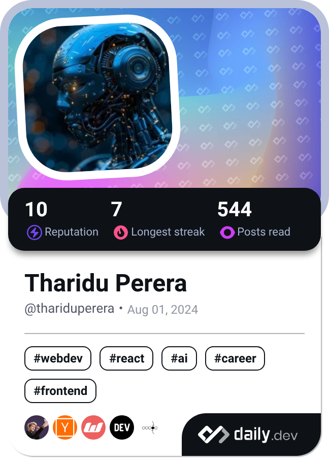

<h1 align="center">Hi 👋, I'm Tharidu Perera</h1>
<h3 align="center">🌟 Intern Frontend Developer | Continuous Learner of New Tools & Technologies | Sri Lanka 🇱🇰 🌟</h3>

  
  

  

- 🌱 I’m currently learning **Nextjs,React,tailwindcss**

- 💬 Ask me about **React and Nextjs**

- 📫 How to reach me **tharinduanjanaofficial@gmail.com**
<h3 align="left">Connect with me:</h3>

<h3 align="left">Languages and Tools:</h3>

                     

&nbsp;

